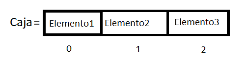
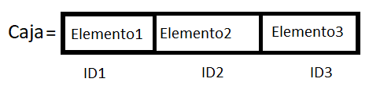

# Capitulo dos
## Indice
* [Arrays](#id20)
* [Arrays Asociativos](#id21)
    * [Implementación](#id22)
* [Bucles e iteración](#id23)
    * [While](#id24)
    * [Do While](#id25)
    * [For](#id26)
        * [Continue](#id27)
        * [Break](#id28)
    * [For in y For Of](#id29)
    * [Labels](#id30)
* [Funciones](#id31)
    * [Parámetros](#id32)
    * [Funciones Flecha](#id33)
* [Problema del mundo real](#id34)

### [Volver al Capitulo 1](./README.md)

## Arrays 

Los arrays son un tipo especial de variable, las variables eran cajitas donde guardabamos los datos, los arrays por su parte es una caja más grande que puede guardar y separar muchos datos de forma organizada gracias a los Indices o Posicionamientos.

Funciona de esta manera, en la caja vamos a ir guardando datos al declararlos, para sacarlos modificarlos leerlos o borrarlos necesitamos acceder a su indice, para un ejemplo más gráfico podemos ver el siguiente ejemplo gráfico:

Como puedes observar la caja tiene elementos, tres elementos para ser exactos, para poder leer de forma ordenada el contenido de la caja lo tenemos que hacer a través de los indices que son los numeros de debajo de los elemntos, para poder leer el elemento 2 necesitaríamos acceder al indice numero 1 y se escribiría así:

    let extraccion=caja[1];

el indice 1 apunta a la posición 2 dentro de la caja y es por que en programación y en específico para los indices empezamos a contar desde el numero 0, es decir que la suseción aritmética de numeros naturales positivos cambiaría como lo hacemos naturalmente. Comunmente lo haríamos: 1, 2, 3, 4, 5; en programación empezamos a contar: 0, 1, 2, 3, 4, 5; de esta manera nos podemos ir orientando.

La forma de declarar un array identico al de la imagen es la siguiente

    let caja=["Elemento1","Elemento2","Elemento3"];

Sin embargo también le podemos dar a guardar números enteros, flotantes, strings y booleanos según nos convenga.

    let caja2=["alfa", "Bravo", 3, 9, 7.5, 0.1, false, true];

Para acceder a ellos podemos hacerlo con los indices, e incluso operarlos dentro de estructuras con sentencias de control:

    let caja2=["alfa", "Bravo", 3, 9, 7.5, 0.1, false, true];
    if(caja2[3]<10){
        document.write("If1");
    }
    if(caja2[7]){
        document.write("If2");
    }
>El if1 se imprime por que la sentencia caja2[3] osea 9 es menor que 10 así que el resultado de la sentencia caja2[3]<10 es true.

>El if2 se imprime por que el valor guardado en la posición 7 ya es un true por lo que la sentencia es verdadera y el if ejecuta el bloque de código asignado.

## Arrays asociativos 

Los arrays asociativos a diferencia de los arrays normales para acceder a un indice o casilla la etiqueta o indice de cada casilla requiere de un dato de tipo string.

No pueden ser números y un ejemplo de su sintaxis es la siguiente:

    let dni={
        nombre: "Rodrigo",
        apellido: "Flores",
        edad: 21,
        vivo: true,
        altura: 1.70,
    };

Para poder acceder al apellido no ponemos dni[apellido], necesitamos poner dni["apellido"] para que  de esa forma JS sepa en qué indice debe colocarse. la respuesta o valor de retorno de dni["apellido"] es Flores en forma de string.

### Implementación de los arrays asocativos 

Implementemos una impresión en pantalla con los datos de nuestro array asociativo.

    let nombre=dni["nombre"];
    let apellido=dni["apellido"];
    let edad=dni["edad"];
    let estado=dni["vivo"];
    let talla=dni["altura"];
    let frase=`
        Mi nombre es <b>${nombre} ${apellido}</b>  
        Tengo <b>${edad}</b> años  
        Mido <b>${talla}</b>  
        Y mi estado de vida actual es: <b>${estado}</b>  `;
    document.write(frase);

Intentalo ahora con tus datos.

## Bucles e iteraciones 

Los bucles en programación son sentencias de código muy parecidas al if, sin embargo el if una vez que se pregunta s es o no verdadero sigue con el código de forma secuencial, los bucles cuando preguntan si la sentencia se cumple y se ejecuta el código una vez, esta sentencia va a preguntar de nuevo si cumple la sentencia, si sigue cumpliendo la sentencia entonces volverá a ejecutar el código una y otra vez hasta que se deje e cumplir la sentencia

### Bucle while 

Como ya lo había dicho el bucle while preguntará al final de cada ejecución si la condición se sigue cumpliendo o no y ejecutará de nuevo el código. Este es un ejemplo del flujo de datos dentro del ciclo específico.

La forma de declarar un while es la misma que la de un if

    while(sentencia==true){
        //bloque de código a ejecutar
    }

Ejemplo: 
>Cree un programa que imprima el conteo del 1 al 10

    let iterador=0;
    let out=0;
    while(iterador<=10){
        out=`${iterador} `;
        document.write(out);
        iterador++;
    }

### Bucle do while 

Un derivado del bucle while es el bloque dowhile, tiene una sintaxis y acomodo muy parecido al bloque while, solo que el bloque do while lo que nos va a permitir hacer es primero ejecutar el código, y luego verificar que la sentencia se cumpla. 

Ejemplo de tipado y uso de un dowhile

    let iterador=0;
    let out=0;
    do{
        document.write(iterador + " ");
        iterador++;
    }while(numero>6)

¿Por qué este código nos imprime un 0 a pesar de que la sentencia numero>6 no es cierta? por que el do while como dije, primero ejecuta el código y luego pregunta si la condición se cumple.

## Bucle for 

El bucle for a diferencia de los demás bucles al momento de declararlo se le indica un iterador un rango y una forma de hacer crecer el iterador, Es decir, le declaramos le inicializamos y le iteramos.

Partes de un For:
Pt 1. Declaración e inicialización
Pt 2. Condición
Pt 3. Iteración (aumento o decremento)

    for(let i=0 ; i<6 ; i++){
        document.write(i+" ")
    }

La forma estandar o actualizada es la siguiente:

    for(var i = Things.length - 1; i >= 0; i--){
        Things[i];
    }

El bucle for preguntará para cada iteración el valor actual de la sentencia condicional y va a ejecutar el código asignado hasta que la condicional no se cumpla, sin embargo no modifica los valores preasignados. Por ejemplo:

    i=20
    for(let i=6;i>=0:i--){
        document.write(i+" ");
    }
    document.write(i);

El valor de i al terminar el bucle sigue siendo de 20 incluso cuando después de iterar el for y modificar los valores de i

Sin embargo gracias a que JS es un lenguaje de tipo dinámico podemos ver la modificación de la variable i a lo largo del for con el siguiente código:

    let i; 
    for(i=6;i>=0:i--){
        document.write(i+" ");
    }
    document.write(i);

Se está declarando fuera del for, dentro se está inicializando y se ejecuta, fuera del for tenemos la ultima modificación que se le hizo con el -1 que es cuando la variable fue modificada por el operador i-- pero ya no fue válida para la sentencia de control.

De nuevo gracias a que JS es dinámico podemos hacer lo siguiente:

    let i=6;
    for(i;i>=0:i--){
        document.write(i+" ");//(X)
    }
    document.write(i);

"Vas a usar la variable i y ejecutarás el código (X) hasta que la condición i>=0 no se cumpla, en cada iteración modificarás i de la forma i--" -El for en palabras.

(X)= Imprime en pantalla el contenido de i.

### Break 

Break es una sentencia que nos arroja un false en cualquier punto de una iteración, es decir que niega el estado true de la comparación. Ejemplo práctico:

    for(let i=0;i<=20;i++){
        document.write(i+" ");//(X)
        if(i==12){
            break
        }
    }

"Vas a usar la variable i y ejecutarás el código (X) hasta que la condición i<=0 no se cumpla, en cada iteración modificarás i de la forma i++"

(X)= Imprime en pantalla el contenido de i y evalúa si i==12, si i==12 es true deja de hacer todo y espera instrucciones.

### Continue 

Continue funciona similar a break, sin embargo no le pide a la consola que deje de hacer todo lo que está haciendo si no que salte una iteración. Ejemplo práctico:

    for(let i=0;i<=20;i++){
        document.write(i+" ");//(X)
        if(i==12){
            continue;
        }
    }

"Vas a usar la variable i y ejecutarás el código (X) hasta que la condición i<=0 no se cumpla, en cada iteración modificarás i de la forma i++"

(X)= Imprime en pantalla el contenido de i y evalúa si i==12, si i==12 es true salta una iteración y continúa con lo que estabas.

## For IN y For OF 

For in ahorra la declaración y la condicional del for, aparte que lo hace más sencillo por que es ascendente, sien embargo tienen un poco de similitudes. 

En for in la variable de iteración tendrá el valor asignado en cada iteración igual al indice del dato comparado.

En for of la variable de iteración tendrá el valor asignado en cada iteración igual al valor del indice 

Ejemplo práctico:

    let animales=["Gato","Perro","Conejo","Ave"];
    for(animal in animales){
        document.write(animal+" ");//devuelve la posición
    }
    document.write(" ");
    for(animal on animales){
        document.write(animal+" ");//devuelve el valor de la posición
    }

Mostrar elementos con for in:

    let animales=["Gato","Perro","Conejo","Ave"];
    for(animal in animales){
        document.write(animales[animal]+" ");
    } 

## Labels 

Hagamos una simple recapitulación de lo aprendido: 

Diseñe un programa que recorra los siguientes dos arrays:

    array1=["Mango","Plátano","Mamey"];
    array2=["Melón","Naranja",array1,"Mandarina"];

Ejemplo propuesto:

    for(let array in array2){
        if(array==2){
            for(let array of array1){
                document.write(array+" "); //(X)
            }
        }else{
            document.write(array2[array]+" ");
        }
    }

Ahora, que pasaría si deseo terminar ambos bucles for en la ubicación de la bandera (X)? Intenta escribiendo break o continue. 

Para poder solucionar o especificar esto necesitamos usar las etiquetas o labels, también se les dice banderas en otros lenguajes como C++:

Para ejemplificarlo puedes reemplazar la linea de la bandera (X) con "break forUno" o con "continue forUno"

    forUno:
    for(let array in array2){
        if(array==2){
            for(let array of array1){
                //(X);
                document.write(array+" "); 
            }
        }else{
            document.write(array2[array]+" ");
        }
    }

## Funciones 

Todas las funciones tienen 2 características, la declaración y la implementacion 

Las funciones se declaran en JS con la palabra function, lo que toma después es el nombre con el cual se va a llamar la función, sin embargo no puede ser una palabra reservada ni una variable, además que este identificador no debe contener espacios ni caracteres especiales para evitar errores.

Un ejemplo de una declaraciónde función es el siguiente:

>Declaración

    function sumar(){
        let a=3;
        let b=4;
        let resultado=0;
        resultado=a+b;
    }

>Implementación

    sumar();

Propiamente la función ya hace la suma sin embargo no devuelve ningun valor y siempre hace la misma suma independeintemente de cuantas veces le mandemos llamar.

>Puede intentar hacer la implementación de la siguiente manera:

    variable=sumar();
    document.write(variable);

Verá que lo que escribe es undefined devido a que no contienen ningún tipo de dato que retorne esta función

Para que este bloque de codigo llamado función nos regrese un valor específico se usa la palabra reservada return, y es lo que la funcion nos devuelve luego de hacer su proceso. Por ejemplo:

>Declaración

    function saludar(){
        alert("Hola");
        return "la función se ejecutó correctamente";
    }

>Implementación

    let saludo=saludar();
    document.write(saludo);

como lo que escribe es la variable saludo, y esta en su interior tiene el resultado de la función saludar, y esta devuelve "la función se ejecutó correctamente" en el documento deberías ver:

    "la función se ejecutó correctamente"

>El return también termina de ejecutar las funciones tal cual lo hace un break con in for como lo hicimos antes

### Parámetros (función con paso y retorno) 

Como lo dije antes, una función que siempre haga lo mismo es util pero no es optima, lo óptmo es que tengamos una función que nos ayude a realizar cosas distintas o variables dependiendo de lo que nosotros queramos introducir a ellas.

Para eso son los parámetros, estos son variables que definimos en los paréntesis de las funciones y que nos sirven para poder generar el proceso de las funciones con multiples variables o datos a la hora de introducirlos y no necesariamente volviendo a escribir el proceso de la función. Por ejemplo:

>Declaración

    function suma(num1, num2){
        let res=num1+num2;
        document.write(res);
        document.write(" ");
        return res;
    }

>Implementación

    suma(12,15);
    suma(15,19);
    suma(30,2);

Ahora como podemos observar la implementación puede cambiar ya que no importa cuantas veces llamemos la función suma, siempre va a sumar los numeros que mandemos como PARÁMETROS. 

¡Cuidado con la implementación!
Prueba implementando la función suma de la siguiente forma:

    suma(12);

El resultado debería ser NaN ya que estamos sumando 1 con un espacio en memoria, y como lo vimos en el capitulo uno ([Volver al Capitulo 1](./README.md)) cuando operas un numero con algo que no es un numero devuelve un NaN.

>Scope

El alcance o scope que van a tener estas variables es solamente n la función, es decir que si queremos utilizar la variable y el valkor que contiene en determinado momento la variable num1 tiene que ser exclusivamente dentro de la función, no podemos operar con la variable en ningun momento si se está fuera de la función. para ejemplificar esto prueba con el siguiente codigo:

    function suma(num1, num2){
        let res=num1+num2;
        document.write(res);
        document.write(" ");
        return res;
    }
    suma(12,15);
    document.write(num1);

Abre la consola: "num1 is not defined"

El paso de parámetros funciona de la misma forma para los parámetros que sean caracteres o del tipo string. Ejemplo:

    function saludar(nombre){
        let frase= `Hola ${nombre} ¿como estas?`;
        document.write(frase);
    }
    saludar("Pedro");

Una forma de escribir esto es de la siguiente manera:

    const saludar = function(nombre){
        let frase = `Hola ${nombre} ¿como estas?`;
        document.write(frase);
    }
    saludar("Pedro");

La constante saludar va a ser la función que va a recibir nombre como parámetro va a hacer un string y lo va a imprimir.

>¿cómo romper el scope?

El alcance que se tiene con las variables dentro de una función por buena práctica se hace con let para que el scope de la variable sea dentro de la función o de las llaves que la estén conteniendo, sin embargo como se vio en el capitulo 1 ([Volver al Capitulo 1](./README.md)), al no declarar de que tipo de variable se trata, este se sobreentiende con var, que tiene un alcance global, lo cual nos puede traer muchos errores a la hora de desarollar código de gran tamaño.

## Funciones flecha 

Las funciones flecha es un tipo de declaración de función que nos permite agilizar el desarrollo aparte de contener más propiedades y permitirnos trabajar con diferentes funciones al mismo tiempo, fueron introducifas en ECMS6 y se ven así:

>Función como la conocemos

    const saludar = function(nombre){
        let frase = `Hola ${nombre} ¿como estas?`;
        document.write(frase);
    }
    saludar("Pedro");

>Función flecha

    const saludar = (nombre)=>{   
        let frase = `Hola ${nombre} ¿como estas?`;
        document.write(frase);
    }
    saludar("Pedro");

Esto trae beneficios para el desarrollo de aplicaciones agiles ya que trae beneficios de sintaxis, funciona igual si hacemos cualquiera de los siguientes casos:

>Sin paréntesis (solo si recibe un solo parámetro)

    const saludar = nombre=>{   
        let frase = `Hola ${nombre} ¿como estas?`;
        document.write(frase);
    }
    saludar("Pedro");

>En una sola linea de ejecución

    let frase = `Hola ${nombre} ¿como estas?`;
    const saludar = nombre=>{document.write(frase);}
    saludar("Pedro");

>incluso prescindir de las llaves

    let frase = `Hola ${nombre} ¿como estas?`;
    const saludar = nombre => document.write(frase);
    saludar("Pedro");

Sin embargo por fines prácticos y de desarrollar esto rápido nos quedaremos con la siguiente sintaxis para las funciones:

# Problema del mundo real 
>Problema A

Proporcione el código para fabricar un sistema que cumpla con las siguientes peticiones:
- Solo ingresen los mayores de 18 años
- El primero que entre después de las 2 AM no paga

Solución Propuesta:

    let free=false;
    const validarEdad=(time)=>{
        let edad = prompt("Cual es tu edad?");
        if(edad>=18){
            if(time>=2 && time<7 && free==false){
                alert("Bienvenido, no pagarás boleto de acceso");
                free=true;
            }else{
                alert(`Bienvenido, son las ${time}Hrs tu boleto de acceso tiene costo de $XX`);
            }
        }else{
            alert("Eres menor de edad, por eso no vas a pasar");
        }
    }

>Problema B

Proporcione el código para fabricar un sistema que cumpla con las siguientes peticiones:
- Registrar personas presentes
- Registrar personas ausentes
- Pasado 30 días mostrar la situación de la persona
- Ausencias máximas 10%

### [Continuar al Capitulo 3](./Cap3JS.md)