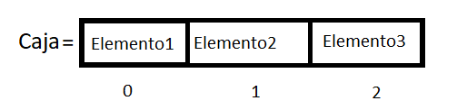

# Capitulo dos
## Indice
* [Arrays](#id20)
* [Arrays Asociativos](#id21)
    * [Implementación](#id22)

## Arrays 

Los arrays son un tipo especial de variable, las variables eran cajitas donde guardabamos los datos, los arrays por su parte es una caja más grande que puede guardar y separar muchos datos de forma organizada gracias a los Indices o Posicionamientos.

Funciona de esta manera, en la caja vamos a ir guardando datos al declararlos, para sacarlos modificarlos leerlos o borrarlos necesitamos acceder a su indice, para un ejemplo más gráfico podemos ver el siguiente ejemplo gráfico:

Como puedes observar la caja tiene elementos, tres elementos para ser exactos, para poder leer de forma ordenada el contenido de la caja lo tenemos que hacer a través de los indices que son los numeros de debajo de los elemntos, para poder leer el elemento 2 necesitaríamos acceder al indice numero 1 y se escribiría así:

    let extraccion=caja[1];

el indice 1 apunta a la posición 2 dentro de la caja y es por que en programación y en específico para los indices empezamos a contar desde el numero 0, es decir que la suseción aritmética de numeros naturales positivos cambiaría como lo hacemos naturalmente. Comunmente lo haríamos: 1, 2, 3, 4, 5; en programación empezamos a contar: 0, 1, 2, 3, 4, 5; de esta manera nos podemos ir orientando.

La forma de declarar un array identico al de la imagen es la siguiente

    let caja=["Elemento1","Elemento2","Elemento3"];

Sin embargo también le podemos dar a guardar números enteros, flotantes, strings y booleanos según nos convenga.

    let caja2=["alfa", "Bravo", 3, 9, 7.5, 0.1, false, true];

Para acceder a ellos podemos hacerlo con los indices, e incluso operarlos dentro de estructuras con sentencias de control:

    let caja2=["alfa", "Bravo", 3, 9, 7.5, 0.1, false, true];
    if(caja2[3]<10){
        document.write("If1");
    }
    if(caja2[7]){
        document.write("If2");
    }
>El if1 se imprime por que la sentencia caja2[3] osea 9 es menor que 10 así que el resultado de la sentencia caja2[3]<10 es true.

>El if2 se imprime por que el valor guardado en la posición 7 ya es un true por lo que la sentencia es verdadera y el if ejecuta el bloque de código asignado.

## Arrays asociativos 

Los arrays asociativos a diferencia de los arrays normales para acceder a un indice o casilla la etiqueta o indice de cada casilla requiere de un dato de tipo string, no pueden ser números y su sintaxis es la siguiente:

    let dni={
        nombre: "Rodrigo",
        apellido: "Flores",
        edad: 21,
        vivo: true,
        altura: 1.70,
    };

Para poder acceder al apellido no ponemos dni[apellido], necesitamos poner dni["apellido"] para que  de esa forma JS sepa en qué indice debe colocarse. la respuesta o valor de retorno de dni["apellido"] es Flores en forma de string.

### Implementación de los arrays asocativos 

Implementemos una impresión en pantalla con los datos de nuestro array asociativo.

    let nombre=dni["nombre"];
    let apellido=dni["apellido"];
    let edad=dni["edad"];
    let estado=dni["vivo"];
    let talla=dni["altura"];
    let frase=`
        Mi nombre es <b>${nombre} ${apellido}</b>  
        Tengo <b>${edad}</b> años  
        Mido <b>${talla}</b>  
        Y mi estado de vida actual es: <b>${estado}</b>  `;
    document.write(frase);

Intentalo ahora co tus datos.