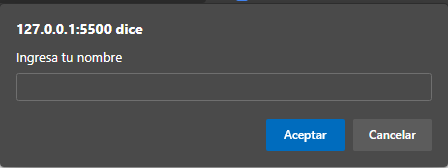

# JavaScript enfocado a NodeJS 

Javascript es un lenguaje de programación interpretado que puede correr en web, es dinámico, multiparadigma y tiene un tipado débil, aquí puedes ver una imagen representativa de cómo son los tipos de tipado de los distintos lenguajes de programación... HTML y CSS no son lenguajes, lo siento. 

## Indice Capitulo 1
* [Diferencias entre JS y NodeJS](#id1)
    * [Requisitos para empezar en JS](#id2)
* [Primeros pasos en JS](#id3)
    * [Declaración de variables](#id4)
    * [Tipos de datos en las variables](#id5)
* [Entrada y salida de datos](#id6)
    * [Input de datos](#id7)
    * [Out de datos](#id8)
* [Operadores de asignación](#id9)
* [Operadores Aritméticos](#id10)
* [Concatenación](#id11)
* [Operadores de comparación](#id12)
    * [Operadores Booleanos](#id13)
* [Camel Case](#id14)
* [Condicionales](#id15)
    * [IF](#id16)
    * [ELSE](#id17)
    * [ELSE IF](#id18)
* [Problemas del mundo real](#id19)

## Indice Capitulo 2
* [Arrays](./Cap2JS.md)
* [Arrays Asociativos](./Cap2JS.md)
    * [Implementación](./Cap2JS.md)
* [Bucles e iteración](./Cap2JS.md)
    * [While](./Cap2JS.md)
    * [Do While](./Cap2JS.md)
    * [For](./Cap2JS.md)
        * [Continue](./Cap2JS.md)
        * [Break](./Cap2JS.md)
    * [For in y For Of](./Cap2JS.md)
    * [Labels](./Cap2JS.md)
* [Funciones](./Cap2JS.md)
    * [Parámetros](./Cap2JS.md)
    * [Funciones Flecha](./Cap2JS.md)
* [Problema del mundo real](./Cap2JS.md)

## Diferencias entre JavaScript y NodeJS 

| JavaScript        | NodeJS      |
|-------------------|-------------|
| Scripts en web | Entorno de ejecución |
| Solo se ejecuta en navegadores | Se ejecuta fuera de los navegadores |
| Utiliza recursos del cliente | Utiliza recursos del servidor |
| Puede agregar HTML | Envía desde el backend documentos HTML |
| Se ejecuta/interpreta en el navegador | Necesita un motor para ejecutarse (V8) |
| Es Front End | Es Back End |
| Los marcos o módulos son TypeScript Ramda o React | Los marcos o módulos son Express y se instalan desde npm |
| Es la versión mejorada del script ECMA que usa V8 de Chrome escrito en C++  | NodeJS está escrito en C, C++ y JavaScript |
| Los errores se muestran en la ejecución | Los errores se muestran en la compilación |

### Requisitos para empez en JS

#### Software

* Git shell https://git-scm.com/
* NodeJS instalado https://nodejs.org/en/
* Visual Studio Code https://code.visualstudio.com/
    * Obligatorias
        * Extensión code runner
        * Extensión ESLint 
        * Extensión JavaScript (ES6) code snippets
    * Opcionales
        * Extensión Prettier o Beautify
        * Extensión Relative Path
        * Extensión Bracket Pair Colorizer
        * Extensión Ident-Rainbow

#### Hardware
* Computadora con un navegador instalado independientemente del sistema operativo

#### Conocimientos 
* En este curso pueden entrar desde básicos hasta avanzados en JS

#### Ayuda
* configuración de GIT y primeros pasos: https://github.com/RodrigoFA216/Git-commands-basic 

## Primeros pasos en JS (JavaScript) 

Todo dentro de este apartado estará dentro del archivo "primero.js"

### Declaración de variables 

Las variables en Javascript se pueden: declarar, inicializar y modificar.
Para declarar las variables podemos usar "var" "let" y "const" a partir de EcmaScript 6 (un estándar)

#### let

Let deja la variable disponible solo para el scope en el que estemos trabajando (dentro del scope para ser más tecnicos). Por ejemplo

    for{
        let azul
        while{
            let rojo
        }
    }

la variable "azul va a estar disponible para operarse dentro del for y dentro del while pero no para lo que siga después del for. A su vez la variable "rojo" va a estar disponible para el while pero no para las operaciones dentro del for que estén fuera del while.

#### const

const como su nombre deja entrever son variables que al ser declaradas van a contener siempre durante todo el probrama el dato con el que se le inicialice, se tiene que inicializar forzosamente en el momento en el que se declara. Esta propiedad se le llama inmutabilidad. Se usa const para las variables que son constantes y no propias del lenguaje como por ejemplo el valor de pi

    const pi=3.14159265359

#### Undefined

Como había dicho las variables se pueden declarar e inicializar, si la variable se declara pero no se inicializa su contenido (es decir no se le da nada a guardar) el tipo de dato de esta variable va a ser undefined. Para ejemplificarlo mejor prueba este código:

    let numero;
    alert(numero);

#### Null

Existe otro tipo de tener una variable vacía a propósito sin hacer uso de no declarar la variable como lo es el asignarle el tipo de dato null. Esto la dejará vacía pero a diferencia del anterior ejemplo lo haremos con intención. Para ejemplificarlo mejor prueba el sieguiente código:

    let numero2= null;
    alert(numero);

#### NaN

Un ultimo tipo de dato nativo es el NaN, no es que ses especificamente un tipo de dato pero si se genera como error o mensaje en el prompt cuando queremos operar de manera normal un string con un numero por ejemplo. Para ejemplificar mejor prueba el siguiente código:

    let numero3=2;
    let string2="Doge";
    alert(numero3*string2);

### Tipos de datos en las variables 

| Tipo de dato      | Ejemplo     |
|-------------------|-------------|
| int (entero) | var entero=2 |
| float (decimal)| var decimal=2.0|
|string (texto) | var texto="Alfred" |
| booleano (true or false) | var bool=false |
| undefined | var numero |
| null | var numero2=null |

## Entrada y salida de datos 

La inserción de los datos en JS se puede hacer de varias formas, desde el HTML y desde el JS.

### Input de datos 

Desde JS se puede hacer con una BuiltIn Function como lo es prompt(), ahora, prompt regresa al scope un valor dependiendo de lo que se ingrese. Es decir, se tiene que declarar una variable con =prompt().

Prompt puede tener un argumento de texto que sea de la siguiente forma

    prompt("< texto >");

Lo que se verá en tu sitio o docuemto será una ventana emergente que tendrá el texto ingresado, en este caso sería

Por ejemplo, para obtener de forma exitosa la inserción del usuario cuando le estamos podiendo su nombre tedríamos que hacer el siguiente código:

    let variable=prompt("Ingresa tu nombre");

### Out de datos 

Para mostrar la salida de los datos introducidos en el paso anterior con JS en el apartado de la función prompt() ya guadados en una variable lo que podríamos hacer es ocupar builtIn Functions, como lo son: document.whrite() y alert().

Alert va a desplegar una ventana flotante al igual que la ventana de prompt() para mostrar los datos que sean necesarios. la función document.write va a generar html específico par apoder escribir el texto que se encuentre en la variable que le demos como argumento, podemos concatenar variables con texto de la siguiente forma:

    let variable=prompt("Introduce un texto");
    alert("El texto introducido es: " + variable);

La BuiltIn Function document.write() funciona similarmente al alert, sin embargo document.write() lo imprimer dentro del documento en el fondo de todo de no especificarse dónde va a ser introducido. Podemos jugar con esto si visualizamos el [Documento](./index.html) que está dentro de este repositorio

    let variable=prompt("Introduce un texto");
    document.write("el texto introducido es: " + variable);

## Operadores de asignación 

Un operador asignación asigna un valor al operando de la izquierda basado en el valor del operando de la derecha... osea se pasa lo de la derecha a la izquierda dependiendo del operador

| Operador | Abreviaciones | Significado |
|---|---|---|
| Asignación | x = y | x = y |
| Asignación de Adición | x += y | x = x + y |
| Asignación de Sustracción| x -= y | x = x - y |
| Asignación de Multiplicación | x *= y | x = x * y |
| Asignación de División| x /= y | x = x / y |
| Asignación de Resto/Módulo | x %= y | x = x % y |
| Asignación de Exponenciación| x **= y | x = x ** y |
| Asignación de Desplazamiento a la izquierda| x <<= y | x = x << y |
| Asignación de Desplazamiento a la derecha| x >>= y | x = x >> y |
| Asignación AND | x &= y | x = x & y |
| Asignación XOR | x ^= y | x = x ^ y |
| Asignación OR | x |= y | x = x | y |

## Operadores aritméticos 

Los operadores aritméticos toman valores numéricos como sus operandos y retornan un valor numérico único.

Tomando en cuenta que:

    let x=10;
    let y=5;
    let r=null;

| Operador | Ejemplo | Ejemplo variable |
|----------|---------|------------------|
| Adición       | x + y | r=x+y; |
| Substracción  | x-y | r=x-y |
| División      | x/y | r=x/y |
| Multiplicación| x*y | r=x*y |
| Incremento    | x++ | r=x++ |
| Decremento    | x-- | r=x-- |
| Exponenciación| x**y | r=x**y |
| Resto         | x%y | r=x%y |
| Negación unaria| -x | r=-x |
| Adición unaria | +x | r=+x |

## Concatencaión 

Como tal la concatenación es unir dos strings. No hay más y no hay menos. Por ejemplo:

    let saludo="Hola Juanjo";
    let pregunta="¿cómo estás?";
    let frase=saludo+pregunta;
    document.write(frase);

Ahora, pongamos el ejemplo de que quiero concatenar numeros, no sumarlos. 

    let numero1=5;
    let numero2=6;
    let frase=""+numero1+numero2;

Sin embargo JS también teien un BuiltIn Method que es concat() sin embargo necesitamos un string con un numero, con lo que haríamos

    let numero1="58";
    let numero2=6;
    let frase=numero1.concat(numero2);

Existen otras formas de concatenar como lo son las backticks:

    let nombre="Rodrigo Flores";
    let frase=`soy ${nombre} y estoy caminando`

(los backticks se ponen con la tecla de AltGr y la tecla de cierre de } en la distribución de teclado latinoamericano, osea con el @ en la Q muchasveces al ser un acento como ^ necesita de la tecla espaciadora)

con el uso de backticks también podemos incluir comillas simples y comillas dobles en nuestros strings sin hacer cosas raras como usar ascii con C/C++ por ejemplo:

    let nombre="Rodrigo Flores";
    let frase=`soy ' "${nombre}" ' y estoy caminando`

Por lo que los BackTicks nos dan una mayor soltura en el tipado e inserción de HTML y CSS con la utilización de métodos instancias y funciones de JS

## Operadores de comparación 

Los operadores de comparación son operadores específicos que devuelven un valor booleano según los parametros de inserción, es decir que va a comparar dos datos y va a devolver un valor true o valor false en función de los parametros que le ingresamos. 

Tomando en cuenta que:

    let x=10;
    let y=5;

| Operador | Ejemplo | Valor |
|----------|---------|-------|
| Igualdad      | x == y | false |
| Desigualdad   | x != y | true |
| Identidad     | x === y | false |
| DesIdentidad  | x !== y | true |
| Mayor que     | x > y | true |
| Mayor o igual que| x >= y | true |
| Menor que     | x < y | false |
| Menor o igual que| x <= y | false |

La diferencia de identidad e Igualdad en JS es la siguiente:

El operador de Igualdad verifica que los datos ingresados sean iguales independientemente de sus tipos de datos:

    let numero=23;
    let texto="23";
    document.write(texto==numero);
>Resultado: true

El operador Identidad compara los datos no solo por su contenido si no por su tipo de dato también:

    let numero=23;
    let texto="23";
    document.write(texto===numero);
>Resultado: false

Sucede lo mismo con !== y !=

El operador Desigualdad compara dos valores sin importar el tipo de dato:

    let numero=23;
    let texto="23";
    document.write(texto!=numero);
>Resultado: false
El tipo de dato es distinto pero le estoy preguntando si la variable texto es diferente a la variable numero. Como no le importa el tipo de dato me dice que es false por que si contienen  lo mismo

El operador DesIdentidad compara dos valores priorizando el tipo de dato:

    let numero=23;
    let texto="23";
    document.write(texto!==numero);
>Resultado: true

### Comparadores booleanos 

Los comparadores booleanos son similares a los comparadores normales, sin embargo los comparadores booleanos solo pueden comparar valores booleanos, ya sea que provengan de una variable con un dato booleano o de una expresión previamente comparada.

Tomando en cuenta que:

    let a=12;
    let b=24;
    let c=25;
    let d=92;
    let e=91;
    let f=true;
    let g=false;

| Operador | Ejemplo | Valor |
|----------|---------|-------|
| Compuerta AND | f&&g | false |
| Compuerta OR  | f||g | true |
| Compuerta NOT | !f | false |
|  | !g | true |

Como lo dije antes, los operandos pueden venir desde una variable con un dato booleano o desde una respuesta a una sentencia de comparación, Por ejemplo:

    let resultado1=(a<b||b<c)&&(!a&&e!=d);
>Resultado: False

## Camel case 

El camel case o tipado de tipo camello es el paradigma con el cual según las buenas prácticas debería funcionar JS, tanto para las variables como para las funciones. Consiste en que si nuestra función / variable tiene dentro más de una palabra util para describir su funcionamiento se va a escribir de la siguiente manera:

Imaginemos que necesitamos escribir la función para que un perro azul maulle... si, bastante original:

### Variables

    let perroAzulMaullido;

### Funciones

    function perroAzulMaullido(){
        let perroAzulMaullido;
    }
Como podemos observar la primera palabra aparece en minusculas, la segunda con la letra inicial en mayúscula y lo semás en minuscula, así mismo con la siguiente palabra, y d etener más deberían seguir el mismo patrón para poder ser legibles facilmente y rápido ya que como sabemos, más del 80% del tiempo d eprogramación leemos código en vez de redactar.

## Condicionales 

Los condicionales son conjuntos de instrucciones agrupadas en un bloque de código que se ejecutan si y solo si la sentencia de control es verdadera. Es decir que tenemos que dar una sentencia de control con [Operadores de comparación](#id12) y/o con [Operadores aritméticos](#id10) De esta forma si la sentencia es verdadera el bloque de código asignado va a ser ejecutado, si la sentencia de control es falsa el bloque de código no se va a ejecutar (El bloque de código es todo lo que esté dentro de {   }  ).

Estructura básica de un condicional:

    condicional {

    }

### Condicional IF 

El condicional IF se puede leer tal cual lo leeriamos en inglés IF=SI, es decir, SI( ) es verdadero entonces { }

Ejemplo práctico:

    let x=10;
    let y=5;
    let a=12;
    let b=24;
    let c=25;
    let d=92;
    let e=91;
    let f=true;
    let g=false;

    if(x>a){
        alert("La sentencia es cierta");
    }
    if(x>=y){
        alert("La sentencia es cierta");
    }
    if(((x+y)<=b--)&&(d===e++||(b+c>e/2)){
        alert("La sentencia es cierta");
    }

### Condicional else 

El condicional IF es un condicional simple, es decir que se va a ejecutar si y solo si es verdad, sin embargo si la sentencia regresa un false, podemos acompañar el bloque de código con el condicional else. 

    var nombre="Rodrigo Flores";
    if(nombre == "Rodrigo"){
        alert("La sentencia es cierta");
    }else{
        alert("La sentencia es incorrecta");
    }

>Ejemplo del mundo real:
Imaginemos que para la auteticación sencilla de un sistema de login requerimos comparar el dato igresado por un usuario con un dato de una base de datos que previamente ya lo guardamos en la variable "validacion".

El resultado de esto también lo puedes encontrar en el [Ejercicio 1](./Capitulos/Ejercicios/Ejercicio1.js)

    var validacion="Rodrigo";
    var nombre=prompt("Por favor, inserte su nombre: ");
    if(nombre===validacion){
        alert(`Bienvenido ${validacion} ¿como estás el día de hoy?`);
    }else{
        alert(`Disculpe ${nombre} su usuario es incorrecto, por favor ingrese un usuario válido`);
    }

### Condicional else if 

Si el condicional if devuelve un valor false podremos tomar dos vías, else para probar cualquier otra opción que no sea previamente evaluada como en el ejemplo 1 que al equivocarse el usuario no importa lo que pase después, queremos hacerle saber que se ha equivocado. Pero ahora, imaginemos que nuestra  plataforma de acceso puede ser para más de un usuario, por lo que tendríamos que hacer más de una validación de la siguiente manera:

    var validacion1="Rodrigo";
    var validacion2="Juan";
    var nombre=prmpt("Por favor, inserte su nombre: ");
    if(nombre===validacion1){
        alert(`Bienvenido ${validacion1} ¿como estás el día de hoy?`);
    }else if(nombre===validacion2){
        alert(`Bienvenido ${validacion2} ¿como estás el día de hoy?`);
    }else{
        alert(`Disculpe ${nombre} su usuario es incorrecto, por favor ingrese un usuario válido`);
    }

## Problemas del mundo real 

>Necesitamos hacer un programa que nos indique que refresco podemos comparar en función de los precios dados en una tienda. El programa recibirá la entrada de texto y deberá evaluar para qué refresco nos alcanza (empezando por el más caro) y mostrarnos una lista de los que podemos comprar, aparte de indicarnos el cambio o vuelto que recibiríamos de elegir cualquiera.

[El resultado lo puedes encontrar en: ](./Capitulos/Ejercicios/Ejercicio2.js)

    var coke=3, powerade=2.9, fanta=2.7, pepsi=2.5, fuzeTea= 2.1, sprite=2.0, agua=1.5;
    var dinero=prompt("Hola, por favor ingresa cuantos dólares tienes?");
    var vuelto=parseInt(dinero);
    if(vuelto>=coke){
        alert(`En realidad te alcanza para todos los refrescos, tu cambio sería el siguiente:`);
        alert(`coke: ${vuelto-3} powerade: ${vuelto-2.9} fanta: ${vuelto-2.7} pepsi: ${vuelto-2.5} Fuze Tea: ${vuelto-2.1} sprite: ${vuelto-2.0} agua: ${vuelto-1.5}`);
    }else if(vuelto<=powerade){
        alert(`En realidad te alcanza para casi todos los refrescos, tu cambio sería el siguiente:`);
        alert(`powerade: ${vuelto-2.9} fanta: ${vuelto-2.7} pepsi: ${vuelto-2.5} Fuze Tea: ${vuelto-2.1} sprite: ${vuelto-2.0} agua: ${vuelto-1.5}`);
    }else if(vuelto<=fanta){
        alert(`En realidad te alcanza para casi todos los refrescos, tu cambio sería el siguiente:`);
        alert(`fanta: ${vuelto-2.7} pepsi: ${vuelto-2.5} Fuze Tea: ${vuelto-2.1} sprite: ${vuelto-2.0} agua: ${vuelto-1.5}`);
    }else if(vuelto<=pepsi){
        alert(`En realidad te alcanza para casi todos los refrescos, tu cambio sería el siguiente:`);
        alert(`pepsi: ${vuelto-2.5} Fuze Tea: ${vuelto-2.1} sprite: ${vuelto-2.0} agua: ${vuelto-1.5}`);
    }else if(vuelto<=fuzeTea){
        alert(`En realidad te alcanza para casi todos los refrescos, tu cambio sería el siguiente:`);
        alert(`Fuze Tea: ${vuelto-2.1} sprite: ${vuelto-2.0} agua: ${vuelto-1.5}`);
    }else if(vuelto<=sprite){
        alert(`En realidad te alcanza para casi todos los refrescos, tu cambio sería el siguiente:`);
        alert(`sprite: ${vuelto-2.0} agua: ${vuelto-1.5}`);
    }else if(vuelto<=agua){
        alert(`En realidad te alcanza solo para el agua, tu cambio sería el siguiente:`);
        alert(`agua: ${vuelto-1.5}`);
    }else{
        alert(`En realidad no te alcanza para nada :c`);
    }

### [Continuar al Capitulo 2](./Cap2JS.md)